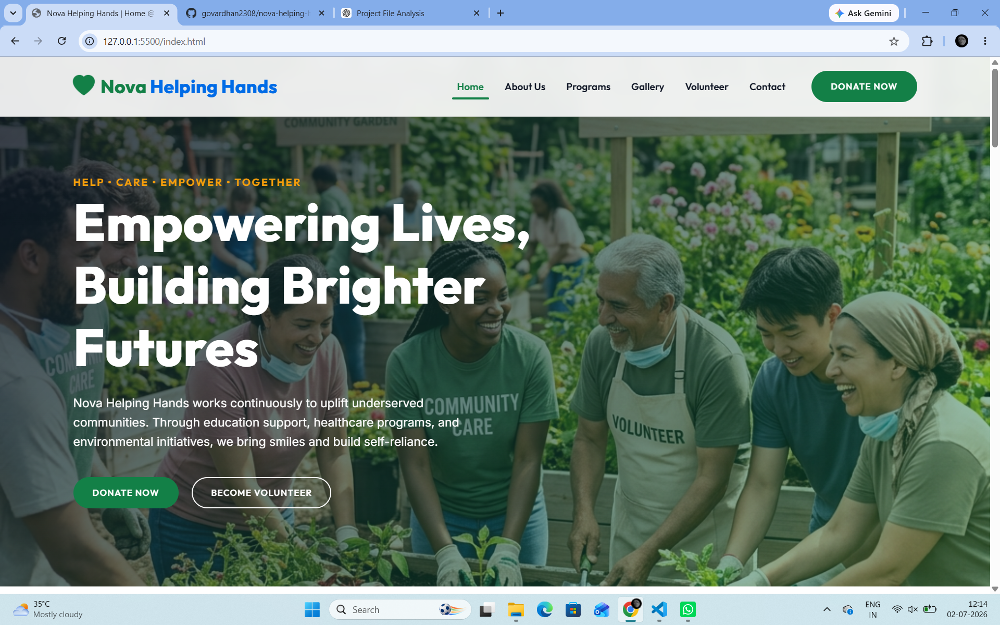
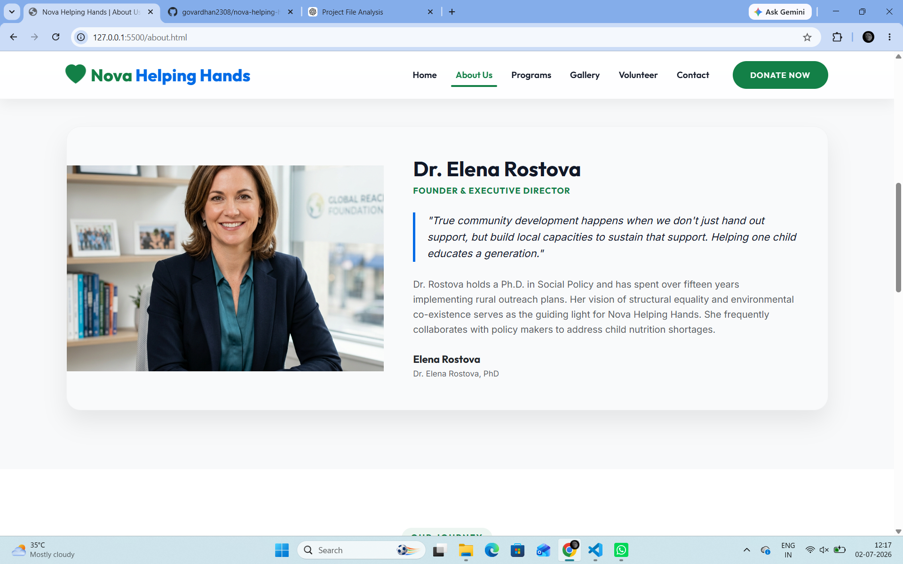
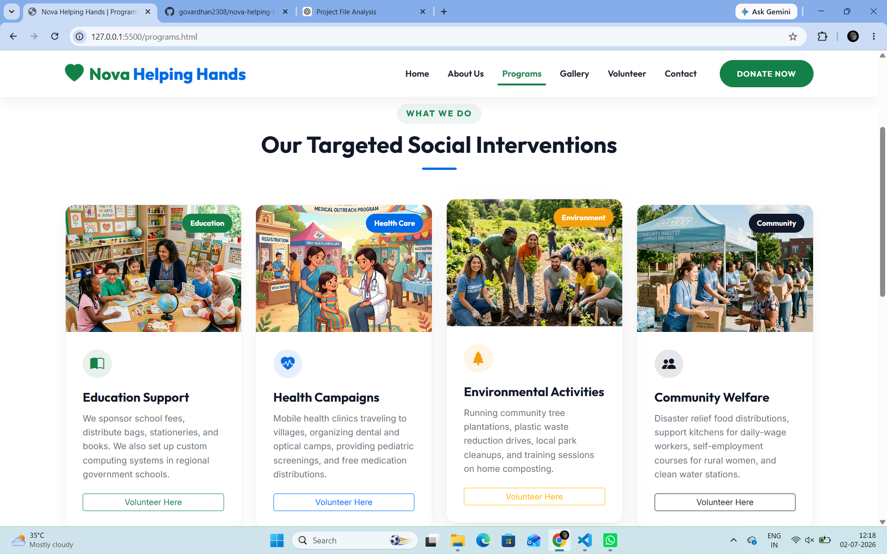
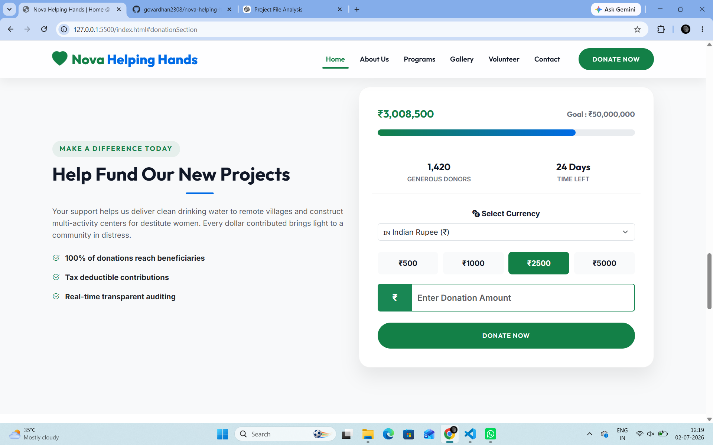
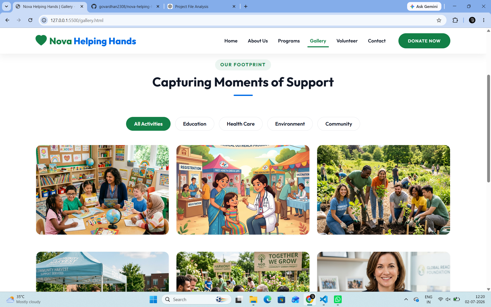
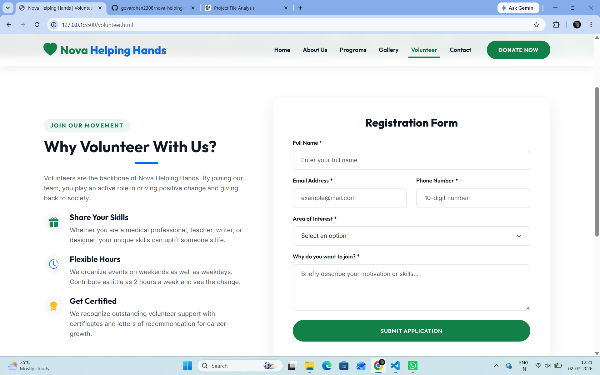
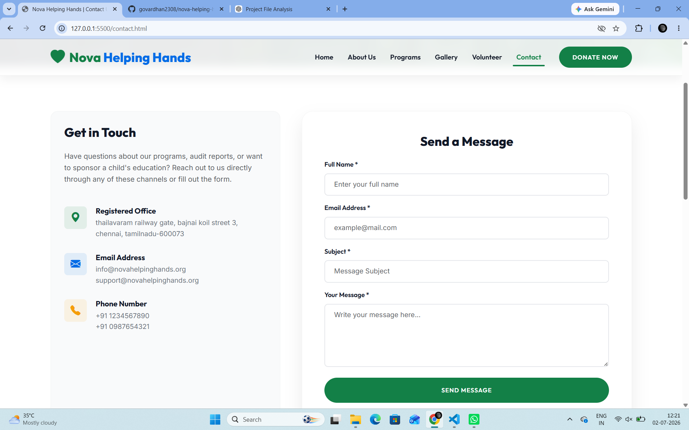

# ❤️ Nova Helping Hands

A modern, responsive NGO website developed to promote social welfare initiatives, encourage volunteer participation, and facilitate online donations. The website provides an engaging user experience with a clean interface, responsive design, and multi-currency donation support for international donors.

---

## 📖 About the Project

Nova Helping Hands is a static web application built to showcase the activities and mission of a non-governmental organization (NGO). The website allows visitors to learn about the organization, explore its programs, register as volunteers, browse the gallery, contact the organization, and make donations.

To improve accessibility for international users, the donation section includes a **multi-currency feature**, allowing donors to view donation amounts in different currencies.

---

## ✨ Features

- 🏠 Responsive Home Page
- 👥 About Us Section
- 📚 NGO Programs
- 🖼️ Gallery
- 🤝 Volunteer Registration Form
- 📞 Contact Page
- 💖 Online Donation Section
- 🌍 Multi-Currency Donation Support
- 📱 Mobile-Friendly Design
- 🎨 Modern User Interface
- ⚡ Smooth Scrolling and Animations

---

## 💱 Multi-Currency Donation

The donation section supports multiple currencies, allowing users to select their preferred currency before donating.

Supported currencies include:

- 🇮🇳 Indian Rupee (INR)
- 🇺🇸 US Dollar (USD)
- 🇪🇺 Euro (EUR)
- 🇬🇧 British Pound (GBP)
- 🇦🇪 UAE Dirham (AED)
- 🇦🇺 Australian Dollar (AUD)
- 🇨🇦 Canadian Dollar (CAD)
- 🇸🇬 Singapore Dollar (SGD)

The displayed donation amounts update dynamically based on the selected currency.

---

## 🛠️ Technologies Used

- HTML5
- CSS3
- JavaScript (ES6)
- Bootstrap 5
- Bootstrap Icons
- Google Fonts

---

## 📁 Project Structure

```
Nova-Helping-Hands/
│
├── assets/
│   └── images/
│
├── index.html
├── about.html
├── programs.html
├── gallery.html
├── volunteer.html
├── contact.html
│
├── assets/
│   ├── css/
│   │   └── style.css
│   └── js/
│       └── script.js
│
└── README.md
```


## 📸 Project Screenshots

### 🏠 Home Page



---

### 👥 About Us



---

### 📚 Programs



---

### 💖 Multi-Currency Donation



---

### 🖼️ Gallery



---

### 🤝 Volunteer Registration



---

### 📞 Contact Page




---

## 🚀 Getting Started

### Clone the Repository

```bash
git clone https://github.com/govardhan2308/nova-helping-hands.git
```

### Open the Project

Open the project folder and launch `index.html` in any modern web browser.

No installation or backend configuration is required.

---

## 📸 Project Pages

- Home
- About Us
- Programs
- Gallery
- Volunteer
- Contact
- Donation Section

---

## 🎯 Project Objectives

- Support NGO awareness and outreach.
- Encourage volunteer participation.
- Provide a simple donation interface.
- Improve accessibility with responsive web design.
- Enable international donors through multi-currency support.

---

## 🔮 Future Enhancements

- Payment Gateway Integration (Razorpay, Stripe, PayPal)
- User Authentication
- Admin Dashboard
- Volunteer Management System
- Event Management
- Donation History
- Email Notifications
- Database Integration
- Live Currency Exchange Rates

---

## 🤝 Contributing

Contributions are welcome.

If you'd like to improve this project, feel free to fork the repository, create a new branch, and submit a pull request.

---

## 👨‍💻 Developed By

**Govardhan N**
&
**Mohankumar M**


---

## 📄 License

This project is developed for educational  purposes.
<<<<<<< HEAD

=======
>>>>>>> 2826e50f4304cafc89d0b067ab18d45b4dd9161f
## 📚 References

The following resources were used during the development of this project:

1. Bootstrap 5 – https://getbootstrap.com/
2. Bootstrap Icons – https://icons.getbootstrap.com/
3. Google Fonts – https://fonts.google.com/
4. MDN Web Docs (HTML, CSS & JavaScript) – https://developer.mozilla.org/
5. GitHub – https://github.com/
6. Git – https://git-scm.com/
7. Visual Studio Code – https://code.visualstudio.com/
8. OpenAI ChatGPT – https://chatgpt.com/ (Used for debugging, feature implementation, and code guidance.)
9. Pinterest – https://www.pinterest.com/ (Used for design inspiration and some sample images.)
<<<<<<< HEAD
=======


>>>>>>> 2826e50f4304cafc89d0b067ab18d45b4dd9161f
